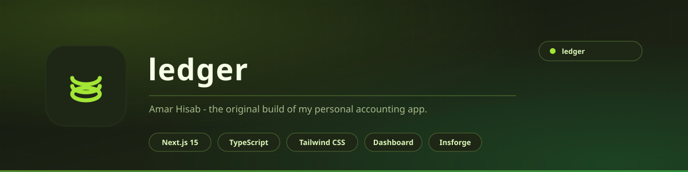

<div align="center">

<picture>
  <source media="(prefers-color-scheme: light)" srcset="docs/assets/banner-light.svg">
  <source media="(prefers-color-scheme: dark)" srcset="docs/assets/banner.svg">
  
</picture>

<br>

**আমার হিসাব** &nbsp;·&nbsp; *Amar Hisab*

The original build of my personal accounting app - the version that proved the idea before it became [ledger-knox](https://github.com/aizenrexx/ledger-knox).

<br>


<br>

[**Features**](#features) &nbsp;&nbsp;|&nbsp;&nbsp; [**Running it**](#running-it) &nbsp;&nbsp;|&nbsp;&nbsp; [**Structure**](#structure)

</div>

---

## What it is

This is where Amar Hisab started: a Next.js 15 app for tracking personal income and spending, with a dashboard, categories and charts.

It is kept as-is because the shape is worth reading. The newer build - [**ledger-knox**](https://github.com/aizenrexx/ledger-knox) - is the one to use: it has the polished dashboard, the marketing pages, the SEO metadata and the live deployment.

> **Use [ledger-knox](https://github.com/aizenrexx/ledger-knox) if you just want the app.** This repository is the earlier, simpler version.

<div align="center">

|  |  |
|:---|:---|
| **Framework** | Next.js 15 (App Router) |
| **Language** | TypeScript |
| **Styling** | Tailwind CSS |
| **Backend** | Insforge |
| **Dev port** | 3005 |

</div>

---

## Features

- **Income and expense entries** with amount, category and date
- **Categories** for organising spending
- **Dashboard** with balance and totals
- **Charts** for spending over time
- **Auth** so the data belongs to you
- **Landing, features, pricing, FAQ, privacy, security and terms** pages
- **Custom cursor** and motion polish throughout

---

## Structure

```
app/
  page.tsx              Landing
  dashboard/            The main app
  auth/                 Sign in / sign up
  features/  pricing/   Marketing pages
  faq/  help/
  privacy/  security/   Legal
  terms/  contact/
  layout.tsx  not-found.tsx
components/
  CustomCursor.tsx
lib/
  insforge.ts           Backend client
  utils.ts
hooks/
  use-mobile.ts
```

---

## Running it

```bash
git clone https://github.com/aizenrexx/ledger.git
cd ledger

npm install
npm run dev          # http://localhost:3005
```

### Environment

Copy `.env.example` to `.env.local` and fill it in:

| Variable | Purpose |
|:---|:---|
| `DATABASE_URL` | Database connection string |
| `NEXT_PUBLIC_API_URL` | Backend API URL |
| `NEXT_PUBLIC_BASE_URL` | Public site URL |

> `.env.local` is git-ignored. Never commit real values.

---

## Licence

MIT - see [LICENSE](LICENSE).

Built by **Aizenrex x Riyad**.
